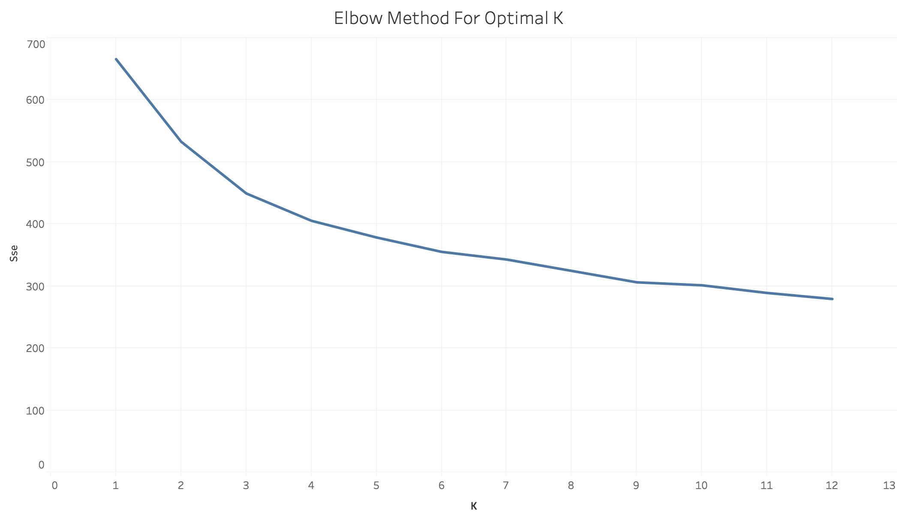
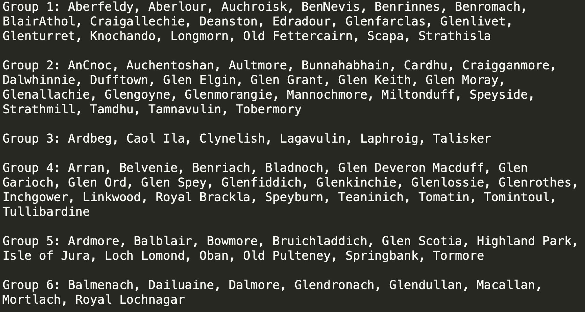

# Clustering
The third approach is to cluster similar whiskies into one group based on the quantified features. We are going to use k-means as the algorithm. This approach partitions whiskies into groups while each whisky within a group commonly has the nearest mean of overall quantified features of characters and flavor. In the application for the Scotch whisky recommendation system, it means whichever whiskies are similar based on the quantified characters and flavor, we group them together into the same group. The idea is that if the consumer has one Scotch whisky in your mind, you may recommend a similar whisky from the same group.

## Strategy
The only problem in a clustering model is pick the hyparameters for k-means. The model training of this phase is to calculate the square sum of errors (SSE) of each model and evaluated the models using Elbow's method.

## Files
1. whisky_clustering.py - Train models in k-means with different K and return the SSE
2. whisky_recommendation.py - Build a prototype prediction model with optimal K
3. Visualization_ScottchClusting.twb (In TableauFiles folder)- Visualizes the numbers of distilleries in each cluster for models when K=4,5,6
4. VisulizeElbowMethod.twb (In TableauFiles folder)- Visualized the SSE for each model on line chart

## Result
Based on the SSE produced from whisky_clustering.py, we concluded the model with K=4,5,6 are the optimal model based on the following line chart using Elbow method:
 

The line chart is produced by VisulizeElbowMethod.twb
  
Technically, it is fine to pick one of the numbers between 4 and 6. However, we also have to consider the usefulness of this application when picking the hyperparameter. We need to consider the size of the group — the numbers of distilleries in each group should not be too many nor too few. Ideally, we want to have the even size of groups and each group should be between 10 and 15 distilleries.
 
On the bar charts produced by Visualization_ScottchClusting.twb, we found that when K=6, the model meets the requirement. Therefore, 6 is the optimal K.

## Prototype Model
Once we have figured out K is 6, we can train the model with this hyperparameter. The file whisky_recommendation.py train this model and cluster distilleries into 6 groups. This file returns the result and saved in a text file. The result looks like this:

  
Or it looks like this on the map:
 

