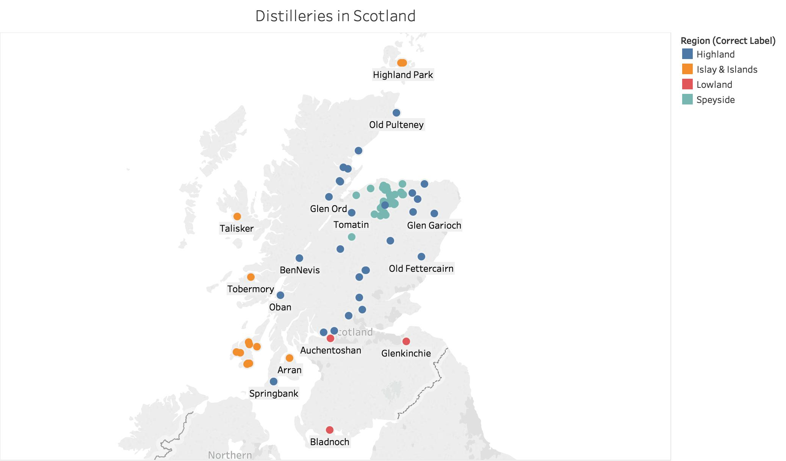

# Data
The original data is downloaded from <a href="https://www.kaggle.com/koki25ando/scotch-whisky-dataset">Kaggle</a> which obtained the data set from WhiskyClassified.com.
  
In the original data set contains 12 columns of characters or flavors, including body, sweetness, smoky...etc. Besides those features, there are columns of distillery name, postcode, UTM latitude and UTM longitude of the distilleries. The columns looks like this:
<ul>
	<li>Distillery — Name of Distillery (String)</li>
	<li>Body (Integer, range from 0–4)</li>
	<li>Sweetness (Integer, range from 0–4)</li>
	<li>Medicinal (Integer, range from 0–4)</li>
	<li>Tobacco (Integer, range from 0–4)</li>
	<li>Honey (Integer, range from 0–4)</li>
	<li>Spicy (Integer, range from 0–4)</li>
	<li>Winey (Integer, range from 0–4)</li>
	<li>Nutty (Integer, range from 0–4)</li>
	<li>Malty (Integer, range from 0–4)</li>
	<li>Fruity (Integer, range from 0–4)</li>
	<li>Floral (Integer, range from 0–4)</li>
	<li>Postcode — Zipcode of the distillery (String)</li>
	<li>LatitudeUTM — Latitude in UTM format (Integer)</li>
	<li>LongitudeUTM — Longitude in UTM format (Integer)</li>
</ul>
  
The columns of Body, Sweetness, Medicinal, Tobacco, Honey, Spicy, Winey, Nutty, Malty, Fruity, Floral are quantified character/flavor, range from 0-4. 0 is None, 4 is the heaviest character/flavor. In the application, I labeled 1="Light", 2="Medium", 3="Strong", 4="Very Strong". Postcode is the UK zipcode in string.
  
Additionally to the original 86 rows by 12 columns data set, I added three more columns:
<ul>
	<li>Latitude in degree</li>
	<li>Longitude in degree</li>
	<li>Region (Region Classification of Whisky Distillery)</li>
</ul>
  
Note: The original data set contains latitude and longitude in UTM that I found it is useful to convert to degree. Latititude and Longitude in degree are very handy to visualize in Tableau.
 
The Whisky distilleries are labeled like this:

  

You may find the [data set](whisky.csv) here.