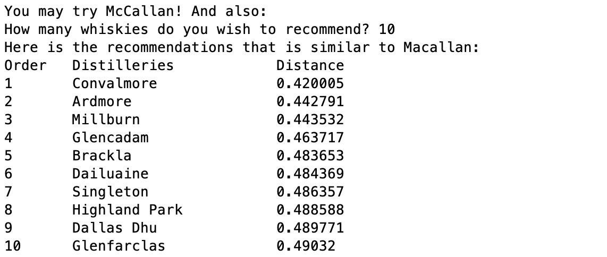

# Python Files (Whisky Analysis by Lapointe and Legendre)
In folder contains the program written in Python. This is the effort to replicate the suggested algorithm used to recommend whiskies suggested by Lapointe and Legendre using Python. The goal is to produce the result and display on an UI using Python.

## Files
<ul>
	<li><i>adj_distance.py</i>: Script to calculate distance among distilleries with the algorithm suggested by Lapointe and Legendre</li>
	<li><i>distance.py</i>: Script to calculate distance among distilleries without any adjustment suggested by Lapointe and Legendre</li>
	<li><i>display_result.py</i>: Script to display the result calculated by <i>adj_distance.py</i></li>
	<li><i>adj_distance.txt</i>: The result calculated by <i>adj_distance.py</i></li>
	<li><i>distance.txt</i>: The result calculated by <i>distance.py</i></li>
	<li><i>display_result.py</i>: Display result on the command line</li>
</ul>

## Workflow
### distance.py
This script calculates similarity with standard Euclidean distance formula.
<br><br>
The workflow of this script is:
<ol>
	<li>Load the whisky character score data</li>
	<li>Calculate the similarity score by directly calculate the norm of the similarity matrix</li>
	<li>Save the result in a distance matrix and save in <i>distance.txt</i></li>
</ol>

### adj_distance.py
This script calculates similarity with weighted Euclidean distance formula suggested by Lapointe and Legendre.
<br><br>
The workflow of this script is:
<ol>
	<li>Load the whisky character score data</li>
	<li>Prepare metadata for the calculation helper</li>
	<li>Calculate the similarity score by calculate the norm of the similarity between 2 whiskies with adjustment formula using the <i>calculate_distance</i> function and store the results into a matrix, repeat that until the matrix is fully filled</li>
	<li>Save the result in a distance matrix and save in <i>adj_distance.txt</i></li>
</ol>
<br>

The workflow of <i>calculate_distance</i> function is:
<ol>
	<li>Calculate the coefficient for each character:
		<ul>
			<li>For each feature type, find the total numbers of characters can be found between two whiskies (Whisky A characters union whisky B characters)</li>
			<li>The coefficient is total number of characters in both whiskies divided by the number of characters in such feature type</li>
			<li>Assign the coefficient for each character</li>
		</ul>
	</li>
	<li>Calculate the similarity score for each whiskies-pair:
		<ul>
			<li>Get the weighted characteristic similarity: Square the difference of character scores between 2 whiskies and multiply by the assigned coefficients</li>
			<li>Sum all the weighted characteristic similarities from the previous steps</li>
			<li>Divided the sum all the weighted characteristic similarities by the sum of weights.</li>
			<li>Take the square root of it to get the Euclidean distance.</li>
		</ul>
	</li>
	<li>Return the Eclidean distance</li>
</ol>


### recommedation_developer.py
This script allows users to interact the result on command line.
<br><br>
<i>recommedation_developer.py</i> relies on the following files:
<ul>
	<li><i>adj_distance.txt</i>: Result from <i>adj_distance.py</i></li>
	<li><i>distillery.csv</i>: For displaying the name of the whiskies/distilleries</li>
</ul>

<br>
Once the script is run, it will enter the homepage: The user may either pick a whisky for to start the recommendation or has the program pick something for him. Then, the program will return the Top 5 most similar whiskies in order along with the distillery names. If the user wish to continue for another recommendation, it will bring the user back to homepage, otherwise, the program will end. 
<br><br>
This script has a developer mode, it allows users to look at the distance between the two selected whiskies and display the number of recommendation the users wish to display. To enable developer mode, add an arguement <b>dev</b> when execute the script on command line.


## Recommendation Application
### Developer Version
In order to run the recommendation application in developer mode, execute this on the command line:

```
python recommendation_developer.py
```

Then, the program will bring ther users to the homepage, where the users can pick a whisky for to start the recommendation or has the program pick something for the users.
<br><br>
If the users decided to pick a whisky for recommendations, the program will list the whisky list available and have the user to select from the list.


<br>
Once the users have selected, the program will return the top 5 whiskies that is the most similar to the user selected whisky.
<br><br>
If the users have no idea where to start and have the program pick something for them, the program will recommend McCallan for the users and show the top 5 whiskes that is the most similar to McCallan.
<br><br>
In either case, the program will ask if the users wish to repeat and end the program.

<br><br>
If the users are interested in the similarity score (Characters distance) among whiskies, or to thave the program return more than or less than 5 whiskies in the recommendation list, the users may run the recommendation application in developer mode by execute:

```
python recommendation_developer.py dev
```

<br><br>
If the users want to use the standard similarity distance, you may run the recommendation application in developer mode and enter <i>standard</i> to indicate the application using standard similarity distance, by execute:

```
python recommendation_developer.py dev standard
```

<br>
The workflow of the program is the same but the program will ask for the number of recommendations to be returned and also display the similarity score in the recommendation like below:



### UI Version
The plan of displaying the recommendation on an UI will be released in the next version.<br>
Coming soon...