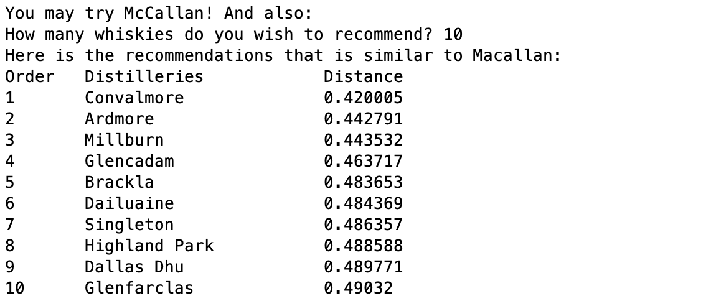

# Whisky Analysis by Lapointe and Legendre
After reading the paper written by Lapointe and Legendre, it inspires many whisky and data lovers to recommend whiskies to the boarder auidence through a quantitative approach. In this exercise, we will explore the approach taken by Lapointe and Legendre and apply for the whisky recommendation system.


## Data
The original data provided by Lapointe and Legendre can be downloaded at this <a href="http://www.numericalecology.com/labo/Scotch/ScotchData.zip">link</a>, and can be found in the <i>Original Data</i> folder in the [Data](/Data) folder. The original data is saved into multiple files, and the aggregated version may be found in the [Data](/Data) folder.

## Algorithm Suggested by Lapointe and Legendre
The algorithm of finding the similarity between 2 whiskies is simply finding the Euclidean distance of the whiskies. However, Lapointe and Legendre suggested that the standard Euclidean distance weighted unequally on every feature type. Instead of computing the similiarity among distilleries, Lapointe and Legendre suggested that the boarder feature types are also as important as the individual character:

```
When computing the similarities, each of the five feature types was given the same importance. 
To achieve this, the characteristics were weighted by 
the inverse of the number of characteristic in their type.
```

<br>
Note: This quotation can be found on page 5 on this <a href="http://www.numericalecology.com/reprints/Appl%20Stat%2043,%201994.pdf">PDF</a>.

<br><br>
In order to do this, we will sum the sum of the weighted characteistic similarities was divided by the sum of the weights to rescale the coefficients between 0 (No characteristic in common) and 1 (Complete similarity).
<br><br>
For example:<br>
Given Bunnahabhain has a descriptors:
<ul>
	<li>Color: Gold</li>
	<li>Nose: Firm, med, smooth</li>
	<li>Body: Sweet, fruit, clean</li>
	<li>Palate: Fresh, sea</li>
	<li>Finish: Full</li>
</ul>

<br>
And given Tullibardine has a descriptors:
<ul>
	<li>Color: Gold</li>
	<li>Nose: Firm, light, smooth</li>
	<li>Body: Sweet, grass</li>
	<li>Palate: Fresh, grass</li>
	<li>Finish: None</li>
</ul>

The calculation of the characteristc distance between 2 whiskies would be taken by the following steps:
<ol>
	<li>Calculate the coefficient for each feature type:
		<ul>
			<li>Use the total number of characteristics in each feature type and plug it as the denominator</li>
			<li>Find the numbers of characteristics that can be found in either whisky and plug it as numerator</li>
			<li>For example, if we calculate the distance between Bunnahabhain and Tullibardine: The coefficient used for Nose is 4/12 - Because there are 4 characters can be found in either whiskies (Firm, med, light, smooth. If the character is mutually found in both whiskies, it counts as 1) and 19 characters available in the Nose feature type. Likewise, Color is 1/19; Body is 4/8; Palate is 3/15; Finish is 1/19</li>
		</ul>
	</li>
	<li>Calculate the Euclidean distance:
		<ul>
			<li>Calculate the weight characteristic similarities for each characteristic. Take the difference between two whiskies on each characteristic, then square it and times it with the coefficient</li>
			<li>Sum all the weight characteristics similarities obtained from the last step</li>
			<li>Sum the weighted coefficients by the number of characters in each feature type. Sum all weighted coefficients summation across the all feature type. In our example, it becomes 4/12*12 + 1/19*19 + 4/8*8 + 3/15*15 + 1/19*19</li>
			<li>Divide Step 2 by Step 3</li>
			<li>Square root of Step 4</li>
		</ul>
	</li>
</ol>


## R
Folder link: [R](R)
<br><br>
Coming soon...

## Python
Here is the folder for the Python scripts and the supporting documentation. And you may also find the recommendation application with this approach in this folder as well.
<br>

Folder link: [Python](Python)

## Result from Standard Similarity Algorithm
Coming soon...

## Result using Lapointe and Legendre's Algorithm
Let's pick McCallan and compare the result with the result generated in the [Clusters](../Clusters) folder. The result of a McCallan looks like this:

<br>
When you compare the whiskies in Group 6 from the result:
<ul>
	<li>Balmenach</li>
	<li><b>Dailuaine</b></li>
	<li>Dalmore</li>
	<li>Glendronach</li>
	<li>Glendullan</li>
	<li>Mortlach</li>
	<li>Royal Lochnagar</li>
</ul>
<br>
Note: <b>Bold</b> means whiskies recommended in both <i>k-Mean</i>(Algorithm used in Clusters folder) and <i>similarity distance</i>(Lapointe and Legendre's suggested algorithm).

<br><br>
You may find the results generated from both algorithms vary, there are two reason: 
<ul>
	<li>The algorithm used with simiarlity distance that the characteristics were weighted by the inverse of the number of characteristic in their type (k-Mean weighted each characteristic equally)</li>
	<li>The dataset used between two folders are different</li>
</ul>

## Comparing the Results
Coming soon...

## Recommendation Application
As mentioned in the previous section, you also find the recommendation application with this approach in the [Python](Python) folder. Note that it is only available in Python.

## Glossary
<ul>
	<li>Feature type: There are 5 general whisky attributes - Color, Nose, Body, Palate, Finish. Each whisky character is classified into one of those 5 groups</li>
</ul>


## Reference
* Paper <a href="http://www.numericalecology.com/data/scotch.html">link</a>
* Example: Whiskey Analytics, Ch 6: Similarity, Neighbors, Clusters, p.145, <i>Data Science for Business</i>, Foster Provost & Tom Fawcett