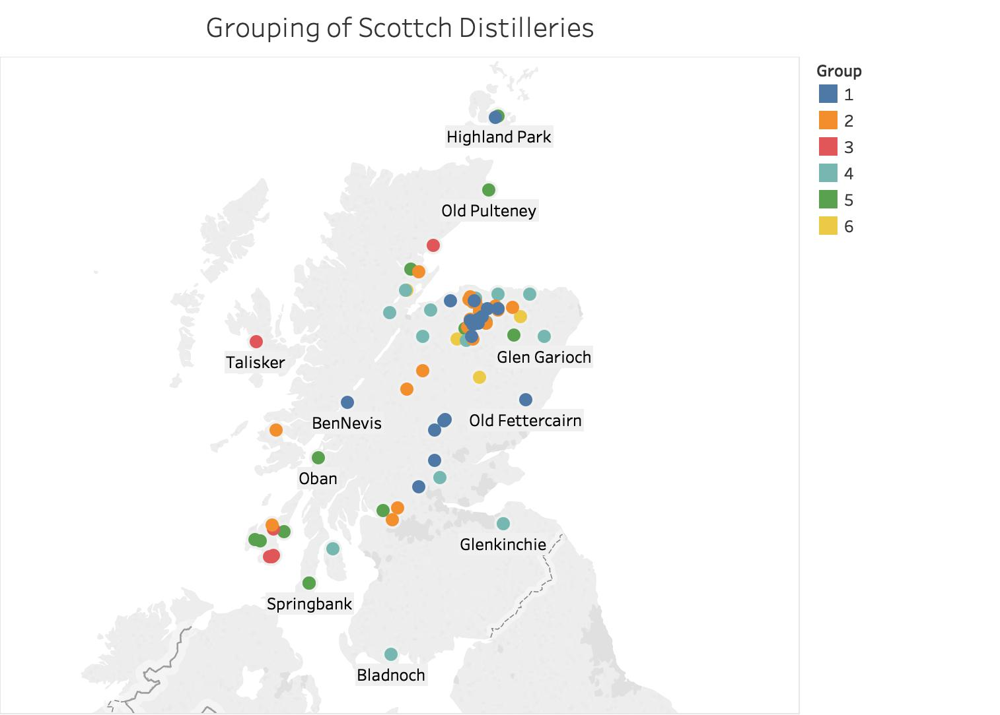

# Scotch Whisky Recommendation System

This project is aimed to build a content-based recommendation system to help Scotch whisky salesmen to recommend Scotch Whisky to a customer based on the quantified quality of the Scotch whiskies. 
  
Please refer to [Report](/Report) to understand the process of how the recommendation system is built. Also, there is a Medium Post to talk about this project. If you would like to read the Medium post, you may refer to the <a href="https://towardsdatascience.com/recommending-scotch-whisky-ea440c2eb289">link</a>
  
Here are the brief structure of this repository.

## Data
The original data is downloaded from <a href="https://www.kaggle.com/koki25ando/scotch-whisky-dataset">Kaggle</a> which obtained the data set from WhiskyClassified.com.
  
In the original data set contains 12 columns of characters or flavors, including body, sweetness, smoky...etc. Besides those features, there are columns of distillery name, postcode, UTM latitude and UTM longitude of the distilleries.
  
Additionally to the original 86 rows by 12 columns data set, I added three more columns:
<ul>
	<li>Latitude in degree</li>
	<li>Longitude in degree</li>
	<li>Region (Region Classification of Whisky Distillery)</li>
</ul>
 
You may find the data set [here](Data/whisky.csv) or the detail of the data set [here](Data).

## Goal of this Project
The goal of this project is to build a content-based recommendation system for whiskies. It means recommending a whisky based on the similarity between two whiskies. There are more than 86 brands of Scotch whisky and I want a model/system to recommend other brands based on the characters and flavor.

## Region Classification
The first approach is to classify which Whisky Region the whisky distilleries are classified. The idea is that each region has its general flavor and characters of the whiskies. The assumption is that a person who likes one highland whisky, I will recommend other highland whisky to that person. The plan of this approach is that once we have trained with a model from 86 distilleries, we can classify the region of the 87th whisky distillery from the model.
  
The detail of the code may be found in the [Region Classification Folder](RegionClassification)
  
However, the result of the classification model does not meet expectation. So, the second step is train the model in hierarchical clustering.

## Dendrogram
Second approach is to use dendrogram to display the hierarchical relationship among distilleries. Dendrogram is one of the algorithms in hierarchical clustering. The idea is to use the quantified characters and flavor to calculate the similiarity of distilleries.
  
This is the Python code for the <a href="Dendrogram/whisky_dendrogram.py">dendrogram</a> or the [Dendrogram Folder](Dendrogram)

## Clustering
The last approach is to cluster the similar distilleries by k-means. And here is the Python code [here](Clusters/whisky_clustering.py) The problem is find the best k for the algorithm.
  
You may go to the [Clusters folder](Clusters) to find out the process of how the recommendation system using k-means.
 
The result looks like this:
 

  
The result of the optimal clustering looks like this on the map:
 

  
The model using the k-means algorithm is useful for recommendating Scotch Whisky. So I decided to use k-mean, with k=6, to build the recommendation system.

## Application
The application will use K=6 to train a K Mean model. The are three ways to return a list of recommendation:
<ul>
	<li>Enter a whisky distillery name</li>
	<li>Choose from a list of characters and flavors</li>
	<li>Nothing</li>
</ul>
 
1. If we enter a whisky distillery name, the application return a list of whiskies within the same cluster. The list of whiskies are sorted by the flavor similarity 
2. If we choose from a list of character and flavors, the application return a list of whiskies that meets the criteria. Note that the whiskies on the list do not belong the same cluster. 
3. If nothing is entered, application suggests Macallan. (See the Application folder for explaination) 
 
 
You may find the codes and the captures in the <a href="https://github.com/jacquessham/ScotchWhisky/tree/master/RecommendationApplication">RecommendationApplication</a>

## Report
In the [Report folder](Report), there is a report of going over how the recommendation system is built by choosing the best model from Region Classification, Dendrogram, and K-means Clustering.
