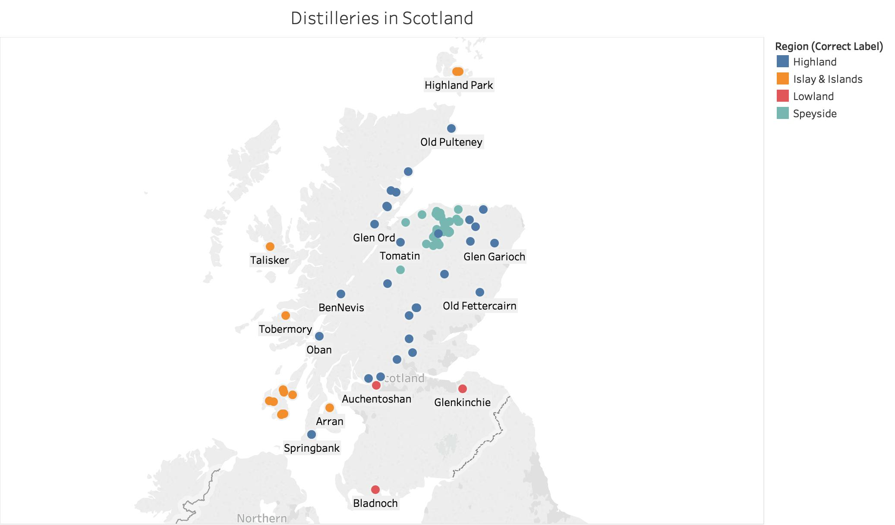
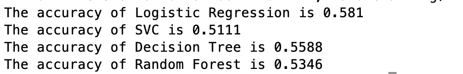
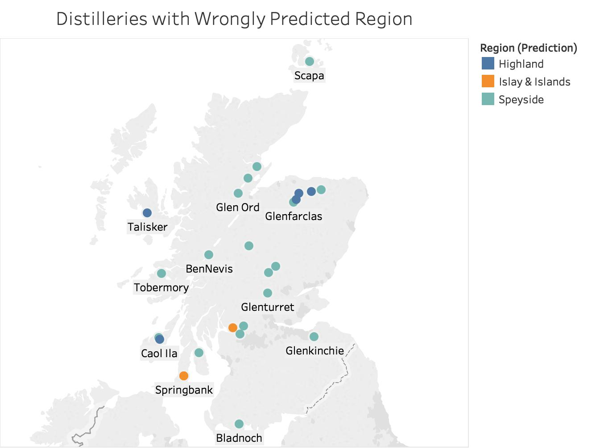
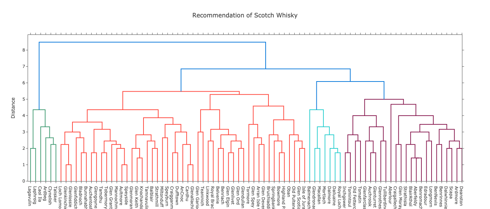
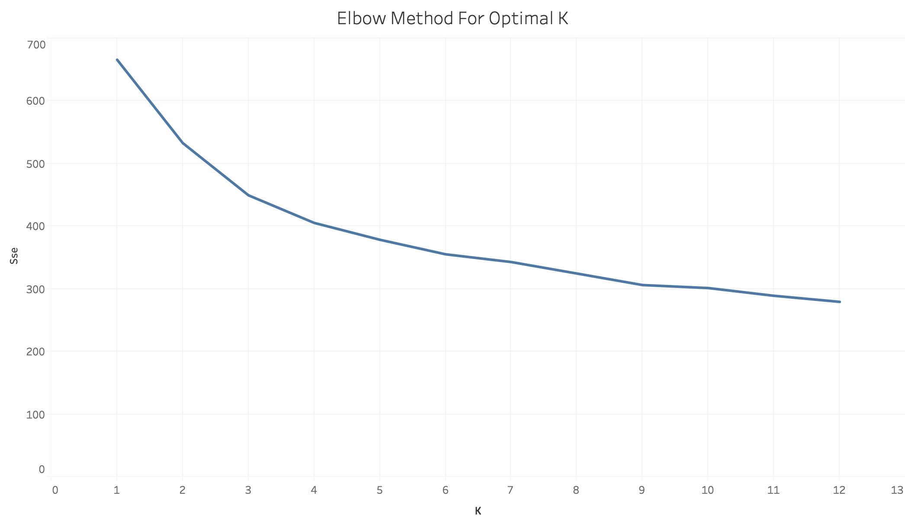
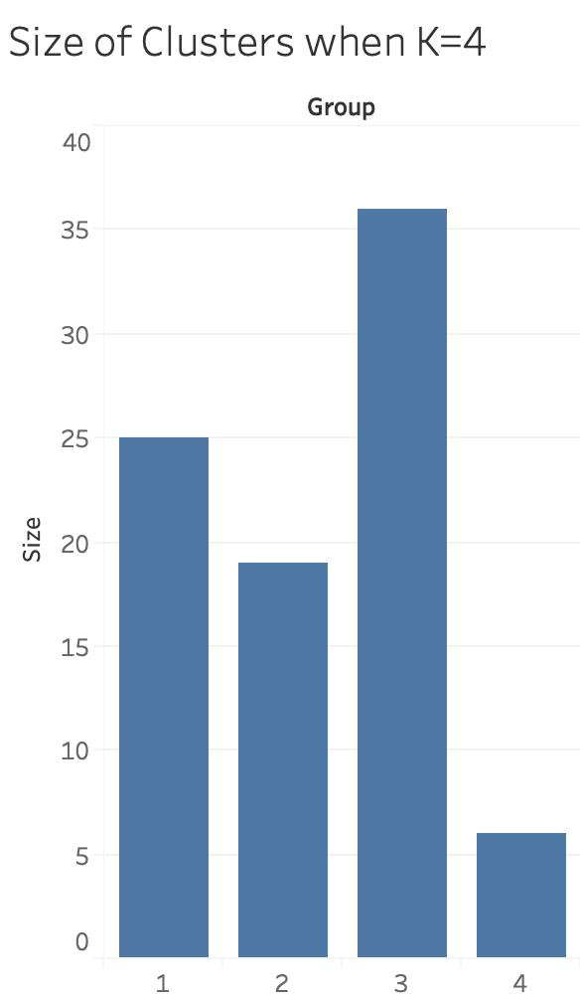
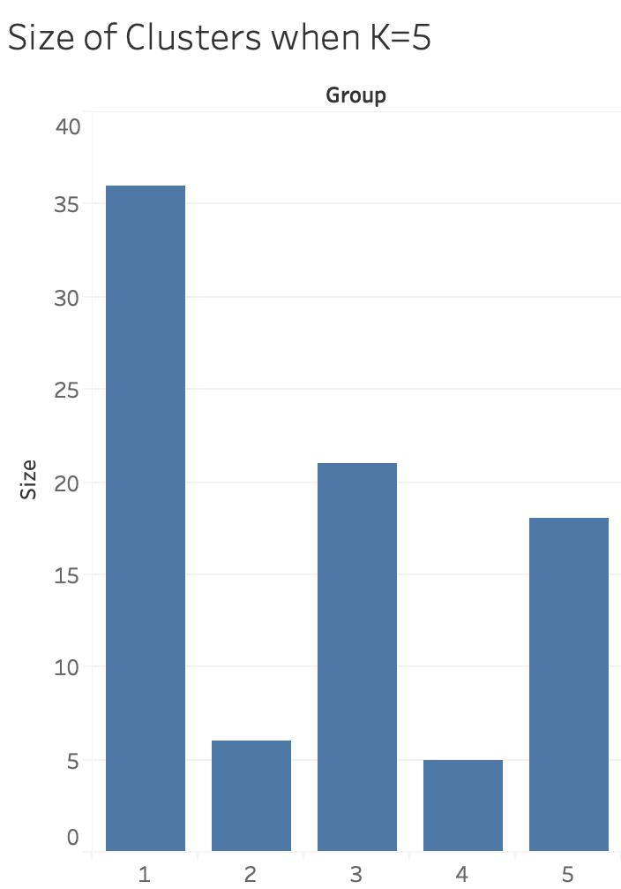
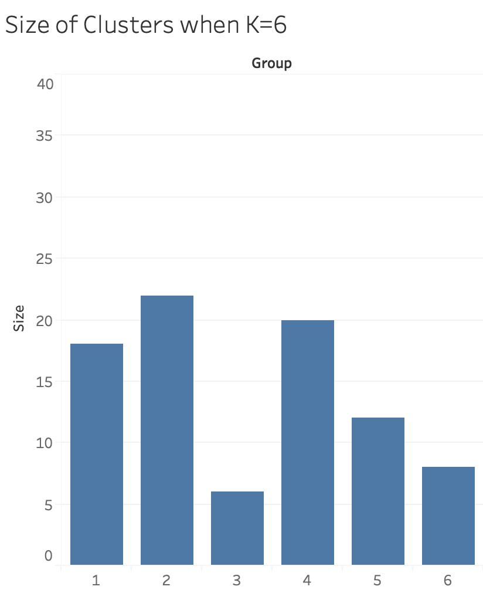

# Scotch Whisky Recommendation System

## Data
The original data is downloaded from <a href="https://www.kaggle.com/koki25ando/scotch-whisky-dataset">Kaggle</a> which obtained the data set from WhiskyClassified.com.
 
 
In the original data set contains 12 columns of characters or flavors, including body, sweetness, smoky...etc. Besides those features, there are columns of distillery name, postcode, UTM latitude and UTM longitude of the distilleries.
 
 
Additionally to the original 86 rows by 12 columns data set, I added three more columns:
<ul>
	<li>Latitude in degree</li>
	<li>Longitude in degree</li>
	<li>Region (Region Classification of Whisky Distillery)</li>
</ul>
 
Note: The original data set contains latitude and longitude in UTM that I found it is useful to convert to degree. 
 
 
The data set only contains selected distilleries in Scotland that makes single-malt whiskies.
 
 
Under the Region column, the whisky distilleries to the following regions based on the classification by <i>Collins gem - Whiskies</i>. In this book, it classifies distilleries to the following regions:
<ul>
	<li>Lowland</li>
	<li>Highland</li>
	<li>Speyside</li>
	<li>Islay and Islands</li>
</ul>
The Whisky distilleries are labeled like this:

 
 
You may find the data set<a href="whisky.csv"> here</a>.

## Goal of this Project
The goal of this project is to build a content-based recommendation system for whiskies. It means recommending a whisky based on the similarity between two whiskies. There are more than 86 brands of Scotch whisky and I want a model/system to recommend other brands based on the characters and flavor.

## Region Classification
The first approach is to classify which Whisky Region the whisky distilleries are classified. The idea is that each region has its general flavor and characters of the whiskies. The assumption is that a person who likes one highland whisky, I will recommend other highland whisky to that person. The plan of this approach is that once we have trained with a model from 86 distilleries, we can classify the region of the 87th whisky distillery from the model.
 
 
I will train the models with 4 algorithm: Logistic Regression, SVC, Descision Tree, and Random Forest.
 
 
This is the code of <a href="whisky_classify_regions.py">Evaluating models</a>. All models are evaluated with cross-validation under the same random state.
 
Result is the following: 

 
As the result, I found that logistic regression model has the best accuracy among all models. Once it is confirmed to train the model with logistic regression, I will use all rows in the data set to train the model with the code <a href="whisky_clf.py">here</a>, and produce prediction.
 
 
However, the problem to the logistic regression model is that the accuracy rate is too low to be useful for prediction. The visualization of wrongly label distilleries made in Tableau can be found <a href="Whisky_WrongLabel.twb">here</a>
 
 
The visualization looks like this:

 
 
The result of region classification is disappointing: The best model only achieves 58% of accuracy, my expectation of a good classification model should have achieved above 80% accuracy. (Explain the models are no good)
 
 
There are some reasons why the models are trained and resulted in low accuracy rate.
<ul>
	<li>The data set is small and not balanced. There are very little observations in Lowland and Islay & Islands.</li>
	<li>The quantitified characters and flavors among Highland and Speyside whiskies are similar.</li>
</ul>
 
 
At the end of the day, this model is only good for Scotch whiskies even the model has a high accuracy rate. We cannot use this model to predict Irish, Japanese, or other foreign whiskies as there is no label be learnt for the regions under those foreign countries.
 
 
I would say this approach is not a good system to recommend whiskies.

## Dendrogram
Second approach is to use dendrogram to display the hierarchical relationship among distilleries. The idea is to use the quantified characters and flavor to calculate the similiarity of distilleries.
 
 

This is the Python code for the <a href="whisky_dendrogram.py">dendrogram</a>. The dendrogram is powered by Plotly and is visualized like this:

 
 
The problems to this approach:
<ul>
	<li>It does not tell you how many clusters</li>
	<li>Visualization becomes hard to read when there are more distilleries</li>
</ul>
 
 
You may find this helpful to understand how to read a dendrogram <a href="https://www.displayr.com/what-is-dendrogram/">here on this article</a> or <a href="https://youtu.be/ijUMKMC4f9I">here at YouTube</a>

## Clustering
The last approach is to cluster the similar distilleries by k-means. And here is the Python code <a href="whisky_clustering.py">here</a>. The problem is find the best k for the algorithm.
 
 
The code produces models for k from 1 to 12 and save the results to csv files. I would like to have clusters that each cluster has more than 3 distilleries but less than 10 distilleries because it makes sense to have at least 2 choices from 1 whisky and too many choices to have more than 10 choices. In the technical side, we use the Elbow Method to pick the best K.
 

 
 
Based on the Elbow method, if the plot between the number of K and the SSE of each model forms an arm on the line chart, the elbow on the arm is the optimal k. And based on the chart above, we can see the elbow is somewhere between 4-6. Since the elbow is not clear, the next step is to find which model has the most balanced numbers of distilleries in each cluster.
 
Here is the statistics on the numbers of distilleries in each cluster when K is between 4 and 6.
 

 