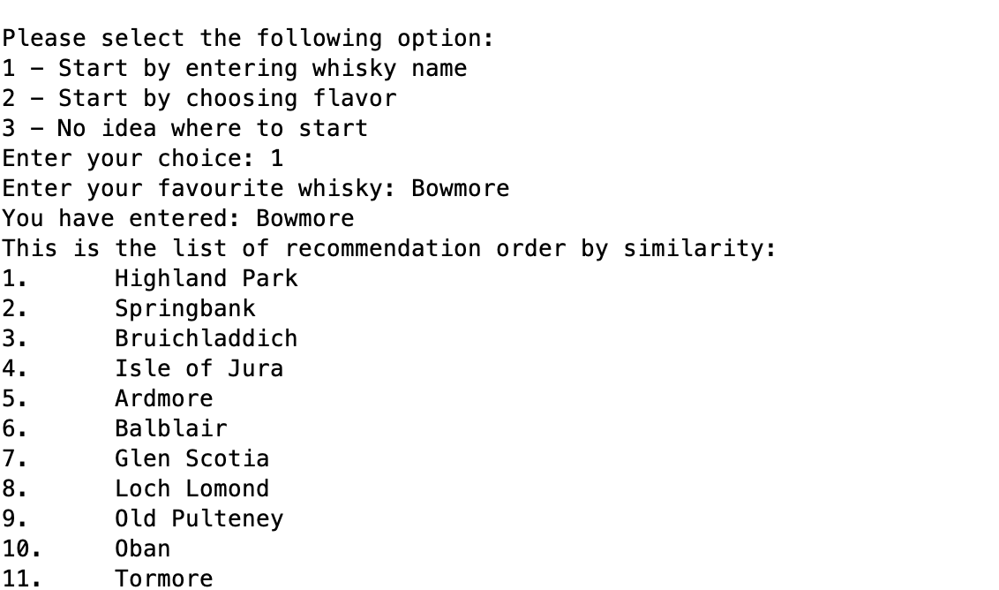
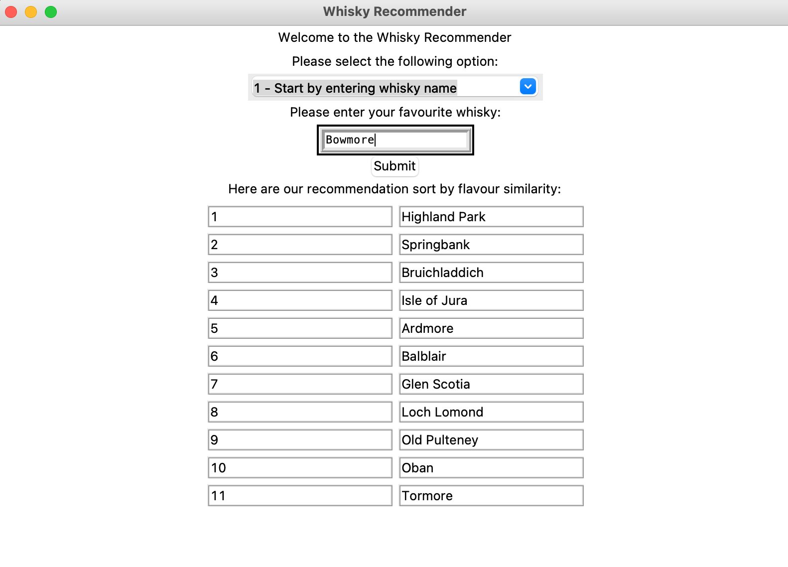
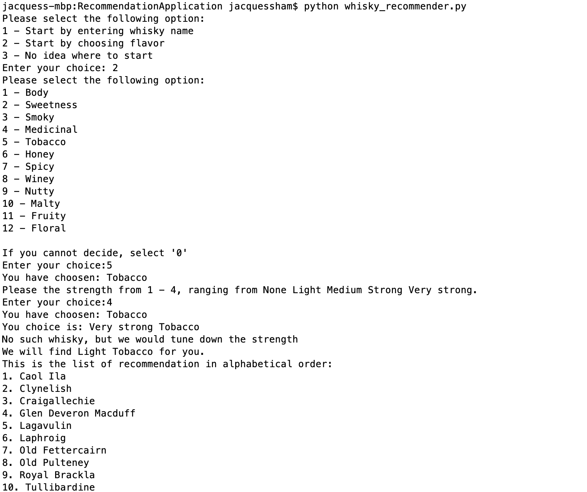
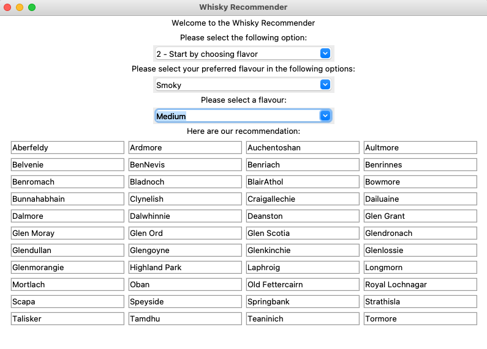
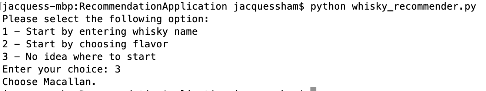
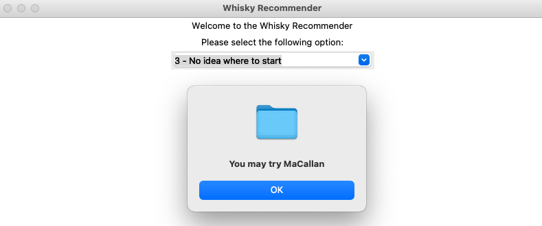

# Application

Once we have determined K Mean Model where K = 6 is the best model. The application would use such hyperparameter to build the model with K mean algorithm with Python and Scikit-learn.
<br><br>
<b>You may refer to the <i>How it Works</i> section to start using the application!</b>

## Cold Start Problem
Before building the application, there is a concern on Cold Start Problem. There are 3 situtation we have to consider for this application:
<ul>
	<li>The consumer has his/her favorite whisky and wants to find a similar one.</li>
	<li>The consumer does not know any whisky but he/she knows what flavor he/she likes.</li>
	<li>The consumer does not know anything.</li>
</ul>

### Case 1: The consumer has his/her favorite whisky and wants to find a similar one.
In this case, we simply recommend a whisky very similar to the whisky consumer likes. The application would return a list of whiskies in the same group. There are 2 approaches of how the list is sorted.
<ul>
	<li>Physical Distance between distilleries</li>
	<li>Euclidean Distance of qualitified flavor between whiskies </li>
</ul>

If sorted by the physical distance between distilleries, the application calculates the euclidean distance of latitude and longitude of the distilleries.
<br><br>
If sorted by the Euclidean distance of qualitified flavor between whiskies, the application calculates the euclidean of the 12 characters and flavor of the whiskies.
<br><br>
The code in the <i>Developer Version</i> in here will be defaulted to sort by the the Euclidean distance of qualitified flavor between whiskies. If you prefer another, comment out the block of the current method and uncomment another block of codes. This code block is deleted in the <i>GUI</i> versions.

### Case 2: The consumer does not know any whisky but he/she knows what flavor he/she likes.
In this case, our goal is to figure out what whisky fits best to the consumer's preference. The application would list all the features we have in the data set and ask the consumer to pick one and score between 1–4 (Cannot pick 0), which the score represents: Light, Medium, Strong, and Very Strong.
<br><br>
Once the consumer has picked and scored the features, the application use pandas to filter the list of whiskies that meets the criteria and sorted by alphabetical order. The whiskies do not cluster into the same group. The goal is to have a list of whiskies that meets the consumer's expectation from what he/she has picked. 
<br><br>
If there is no whisky meets the criteria, the application score down the strength until there is at least one whisky is generated in a list. The reason I score down because the assumption is that people are more likely to accept lighter flavor than heavier flavor.

### Case 3: The consumer does not know anything.
If the person has no idea where to start, we would recommend a whisky which is well-known to non-whisky drinker and does not contain very aggressive flavor. Macallan is a well-known single-malt whisky which gives more confidence to whisky beginners. Secordly, it is not peaty nor having an aggressive flavor. Thirdly, it provides a fruity and sweet texture to drinkers that whisky beginners are more likely to accept.
<br><br>
Based on these reasons, the application recommends Macallan if there is no a lot of input.

## How it works
The application originally was written in <i>Developer Version</i>, then the GUI version written in Python and Ruby (Coming soon) were released afterward.


### Developer Version
Developer Version is the application that interacts on command line, which is a simple version of the application that only interests to developers (Who do not mind reading from commmand line).
<br><br>
There is 2 code files and 1 csv file required.
<ul>
	<li>whisky_recommender.py - The UI file in Python</li>
	<li>script - The folder for the collection of scripts on the backend of the application
		<ul>
			<li>script.py - The Python file prints the options for users</li>
		</ul>
	</li>
	<li> whisky_with_cluster.csv - CSV file with assigned group</li>
</ul>
<br>
First, you need to have use <a href="../Clusters/whisky_recommendation.py">whisky_recommendation.py file</a> to assign each distillery to a group and save to whisky_with_cluster.csv (So that, it does not require the application to train the model every time it runs). Then, run whisky_recommender.py. It will ask which method to recommend whisky, by entering distillery name, selecting flavor and its strength, or input nothing (That represents the 3 cases discussed in last section).
<br><br>
To run the application in this version, you may execute the following code on command line:

```
python whisky_recommender.py
```

### Python GUI
This is the first GUI version, which is written in Python. It is a upgraded version of the <i>Developer Version</i> and allow users to interact the application with GUI. Here are the code files for this version:

<ul>
	<li>pygui_whisky_recommender.py - The Driver script that initiate the application</li>
	<li>pygui - The folder for the collection of scripts on the backend of the application
		<ul>
			<li>gui_helper.py - Populate GUI and the functions to allow users to interact with the application</li>
			<li>recommendation.py - Take user's input and generate a list of recommendated whiskies to users</li>
		</ul>
	</li>
	<li>pydata - The folder for the collection of scripts on loading data and convert to the required format for the application
		<ul>
			<li>load_data.py - Load Data</li>
		</ul>
	</li>
	<li>whisky_with_cluster.csv - CSV file with assigned group</li>
</ul>

To run the application in this version, you may execute the following code on command line:

```
python pygui_whisky_recommender.py
```

### Ruby GUI
Coming soon...


## Features
### Option 1: Entering whisky name
If the user enters the distillery name, the application will find the whisky brands have the similar character/flavor, sorted by the similarity. The similarity is calculated by the Euclidean distance of the quantified flavor and characters (The norm of the two whisky’s flavor and characters).
<br>

<br>
<i>Developer Version</i>


<br>
<i>GUI</i>
<br><br>
For example, if we enter “Bowmore”, the list will be sorted by Highland Park, Springbank…etc, because the Euclidean distance of the flavor and characters between Bowmore and Highland Park is the shortest, followed by Springbank. This a better approach as the list is sorted by the content of the whiskies.


### Option 2: Choosing flavor
If the user does not know any whisky but he/she knows what flavor he/she likes, this option allows the user to enter his/her preference that the application would find the best fit whiksy to the user. The application would list all the features we have in the data set and ask the consumer to pick one and score between 1–4. The application does not allow user to select 0 because 0 means None. Once the consumer has picked and scored the feature, the application would filter a list of whisky that fits the consumer’s preference. If we do not have any whisky that meets the requirement, the application would score down to return a list with a weaker flavor (we assume people are more likely to accept lighter flavor than heavier flavor)
<br>

<br>
<i>Developer Version</i>


<br>
<i>GUI</i>
<br><br>
Once the list is generated, the list of whisky is sorted by alphabetical order and the whiskies do not belong to the same cluster. it requires the work between the recommender and consumers to figure out which whisky consumers like by the recommender’s domain expertise. However, the application makes the recommender’s life easier because the application has filtered to a smaller list from a larger pool of choices. The goal is to find the very first whisky the user likes the most first. Once the first whiksy is figured out, we can recommend a similar whisky from the first whisky.

### Option 3: No idea where to start
As we have discussed Cold Start Problem, if the consumer has no idea on whisky nor picking a flavor, recommend Macallan.
<br>

<br>
<i>Developer Version</i>


<br>
<i>GUI</i>
<br><br>
Note: If you choose option 3 in GUI, the recommendation would be showed in a pop-up message box, instead of the window.

## The Drawback and Thought to this Model/Application
1. One observation for each distillery, it does not recommend which label among all products within one distillery. For example, if the application recommends Laphroaig, it does not tell you whether the user should get 10 Years, Lore, or other label.<br>
2. Concern to how the data is collected<br>
3. Only Single-malt whisky is availabled in the data set, missing blended whisky<br>
4. The model only suits for Scotch Whisky. Other whiskies/whiskeys are fundamentally different in character with Scotch whiskies. Since only Scotch whisky data is available, it is not a good idea to include other whiskies/whiskeys.