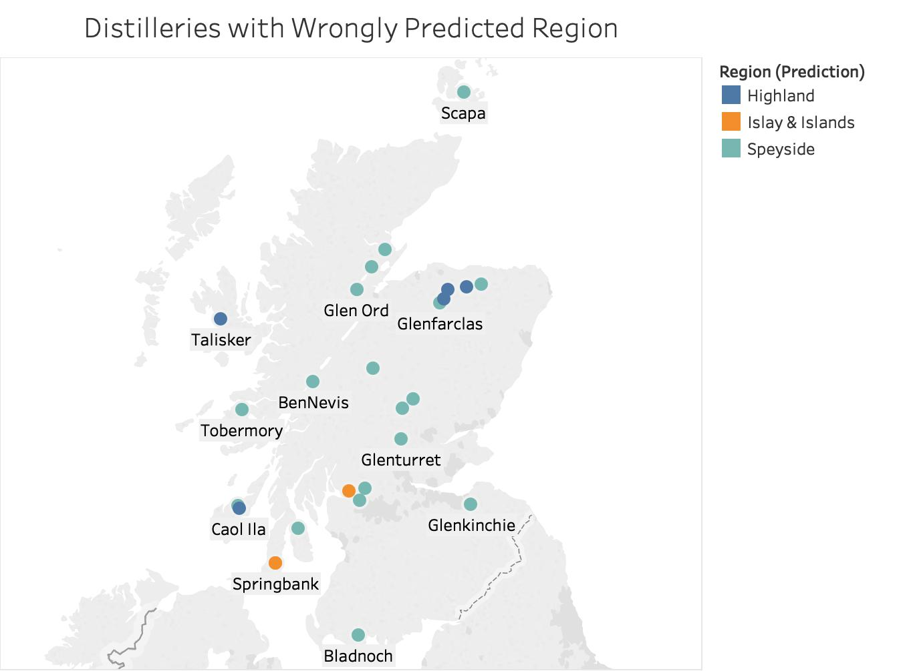

# Region Classification
One idea on how to recommending whisky is that: If the consumer like a whisky in Highland, he is very likely to like a whisky in Highland because both whiskies are from the same region, so the whiskies have similar character/flavor. The goal of this phase is to train the recommendation model to classify which region do the whiskies belong to. If we have the whiskies not in the original data set, such as blended whiskies, the model is able to classify the region the whiskies belong to. Once all the whiskies are classified, we can recommend whiskies in the same region.

## Files
There are 2 python files and 2 Tableau files, which are in the [TableauFiles folder](TableauFiles), in this folder.
  
1. whisky_classify_regions.py - Train models in Logistic Regresion, SVC, Decision Tree, Random Forest
2. whisky_clf.py - Train model in Logistic Regresion only
3. Whisky_CorrectLabel.twb - Visualize the distilleries in correct label
4. Whisky_WrongLabel.twb - Visualize the distilleries in wrong label from the result of whisky_clf.py

## Qualified Character/Flavor
The features used in this phases are
<ul>
	<li>Body</li>
	<li>Sweetness</li>
	<li>Smoky</li>
	<li>Medicinal</li>
	<li>Tobacco</li>
	<li>Honey</li>
	<li>Spicy</li>
	<li>Winey</li>
	<li>Nutty</li>
	<li>Malty</li>
	<li>Fruity</li>
	<li>Floral</li>
</ul>

## whisky_classify_regions.py
This file is trying to find out which algorithm is able to train a recommendation model with highest accuracy. The file uses K-fold to train models with each algorithm and take the average of accuracy. The average of accuracy will be displayed on the command line. As the result, the model trained with logistic regression achieved the highest accuracy, although it is 58%.

## whisky_clf.py
This file is the best model among all models and is written to test the result of identifing the regions for all whiskies in the data set. The models takes all quantified characters and flavor as features. The code filters the distilleries with wrongly labeled region to csv file which will be visualized in Whisky_WrongLabel.twb.

## Result

The result of region classification is disappointing: The best model only achieves 58% of accuracy. And plenty of the distilleries classification was wrong if you compare the result with the right labels.
